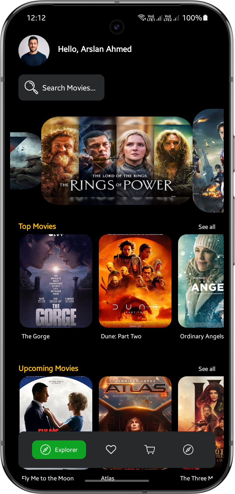
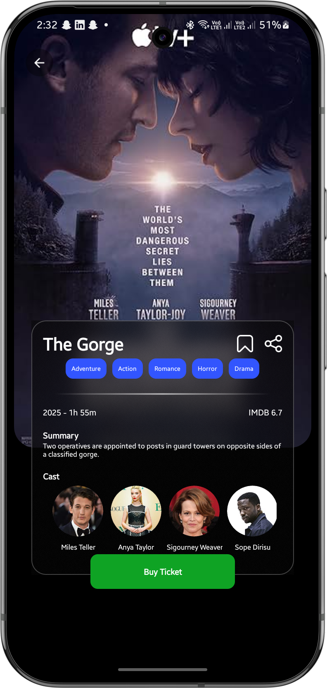
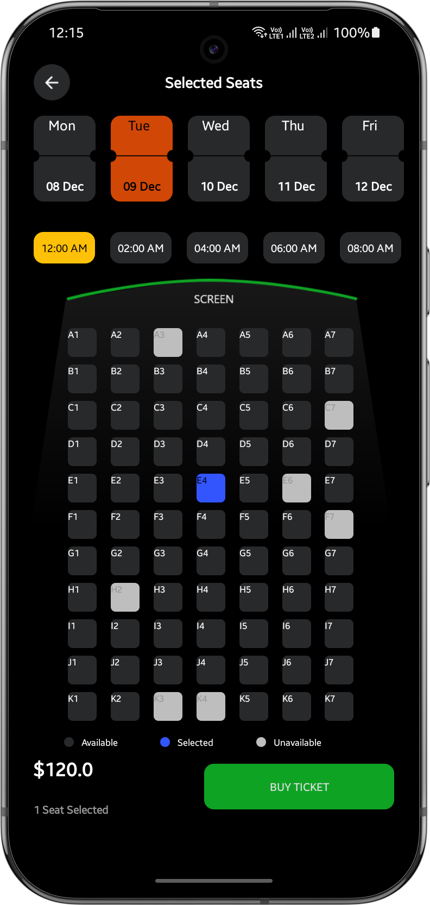
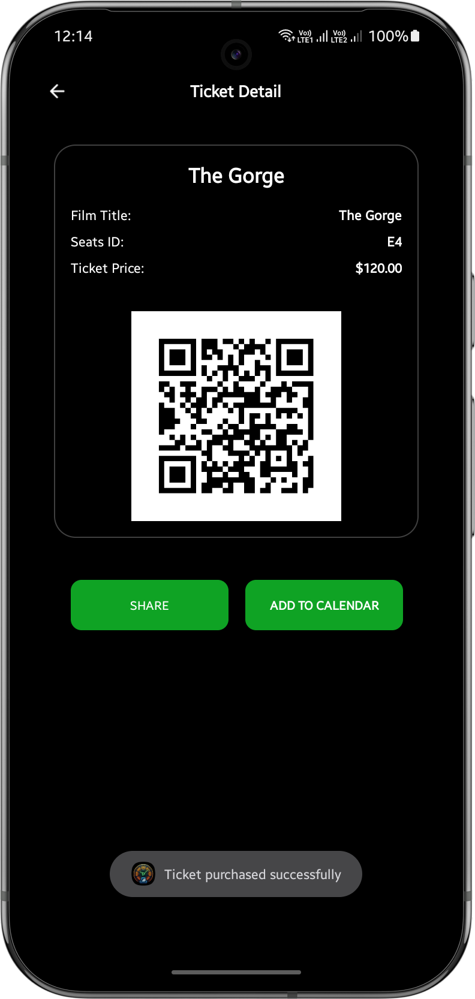
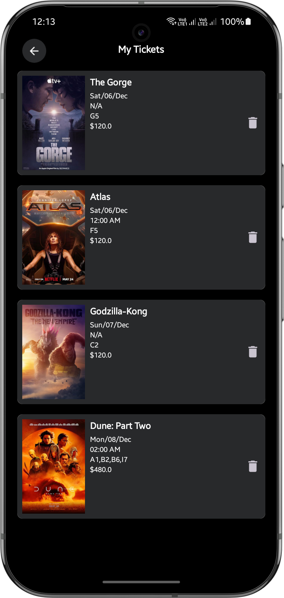
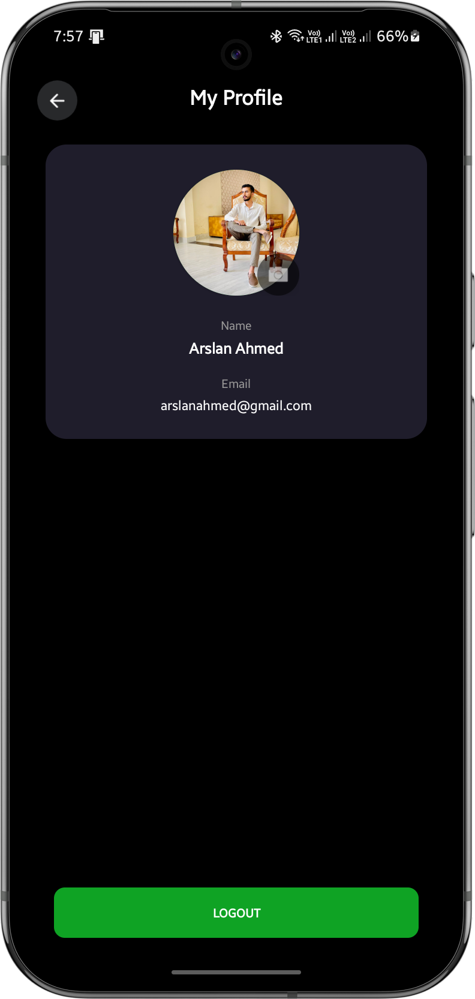

# ReelTime - Movie Ticket Booking App

ReelTime is a modern and intuitive Android application for browsing movies and booking tickets. Built with Kotlin, it offers a seamless user experience with a clean UI and integrates with Firebase for real-time data handling and user authentication.

---

## Features

*   **User Authentication**: Secure login and registration using Firebase Authentication.
*   **Dynamic Home Screen**: A user-specific greeting and a curated main screen featuring banners, Top Movies, and Upcoming Movies loaded directly from Firebase.
*   **Movie Details**: A dedicated screen for each movie, showing its poster, summary, IMDb rating, cast, and more.
*   **Seat Selection**: An interactive seat selection screen where users can pick their desired seats from a grid.
*   **Ticket Generation**: Generates a virtual ticket with a unique QR code after a successful booking.
*   **My Tickets**: A list of all tickets purchased by the user, with the ability to view details or delete old tickets.
*   **Saved Movies**: Users can bookmark movies from the detail screen to a personal "Saved" list for later viewing.
*   **User Profile**: A profile screen displaying the user's name, email, and avatar, with a logout option.
*   **Dynamic Profile Pictures**: Users can upload and update their profile pictures, which are managed and delivered via Cloudinary.
*   **Modern UI**: Smooth animations and a blurred background effect for a polished user interface.

For a more detailed overview of the project architecture and implementation, please refer to the documentation in the `docs` folder.

---

## Screenshots

| Home Screen | Movie Detail Screen | Seat Selection |
| :---: | :---: | :---: |
|  |  |  |

| Booked Ticket Detail | My Tickets | Profile Screen |
| :---: | :---: | :---: |
|  |  |  |

---

## Technologies Used

*   **Language**: [Kotlin](https://kotlinlang.org/)
*   **Core**: Android SDK, AppCompat
*   **UI**: XML, View Binding, Material Components, CardView
*   **Architecture**: MVVM (Model-View-ViewModel) approach per activity
*   **Services**:
    *   **Firebase Suite**:
        *   [Firebase Authentication](https://firebase.google.com/docs/auth) - For user login and registration.
        *   [Firebase Realtime Database](https://firebase.google.com/docs/database) - For storing movie data, tickets, and saved movies.
    *   **[Cloudinary](https://cloudinary.com/)**: For cloud-based image storage, management, and delivery.
*   **Asynchronous Programming**: Coroutines for background tasks.
*   **Third-Party Libraries**:
    *   [Glide](https://github.com/bumptech/glide) - For efficient image loading and caching.
    *   [Chip Navigation Bar](https://github.com/ismaeldivita/chip-navigation-bar) - For the animated bottom navigation.
    *   [BlurView](https://github.com/Dimezis/BlurView) - For real-time background blur effects.
    *   [ZXing (Zebra Crossing)](https://github.com/zxing/zxing) - For generating QR codes on tickets.

---

## Documentation
For a more detailed overview of the project architecture and implementation, please refer to the `ReelTime_Android_App_Documentation_v1.0.pdf` file in the `docs` folder.

---

## Future Improvements

*   **Search Functionality**: Implement a real-time search feature for movies.
*   **Payment Gateway**: Integrate a payment system for actual ticket purchases.
*   **Movie Trailers**: Add the ability to watch movie trailers within the app.

---

## Contributing

Contributions are welcome! If you have any ideas, suggestions, or find a bug, please open an issue or submit a pull request.

---

## License

Distributed under the MIT License. See `LICENSE` file for more information.

---

## Developed by

Arslan Ahmed - [arslanahmednaseem@gmail.com](mailto:arslanahmednaseem@gmail.com) 

---

## Acknowledgments

*   [Firebase](https://firebase.google.com/)
*   [Cloudinary](https://cloudinary.com/)
*   [Glide](https://github.com/bumptech/glide)
*   [Chip Navigation Bar](https://github.com/ismaeldivita/chip-navigation-bar)
*   [BlurView](https://github.com/Dimezis/BlurView)
*   [ZXing](https://github.com/zxing/zxing)

